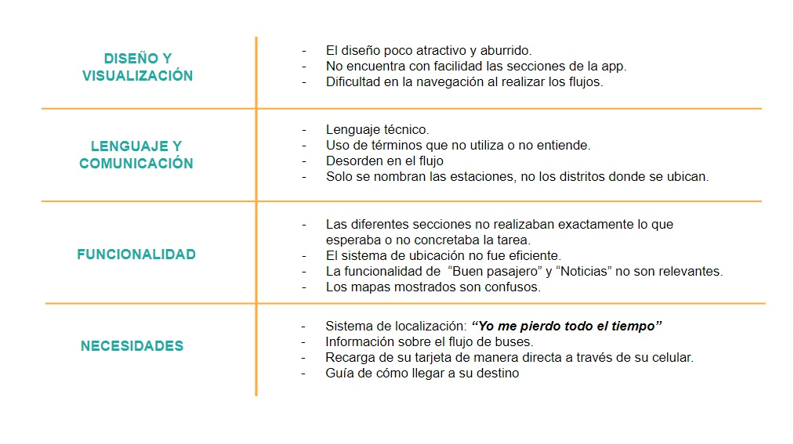

# **METROPOLITANO APP**

El proyecto consiste en el re diseño de la aplicación del Metropolitano, para mejorar funciones de accesibilidad, funcionalidad y experiencia de usuario. A través de un proceso de investigación y conocimiento del usuario, se identificó las necesidades principales y requerimientos a mejorar.

## OBJETIVO DEL PROYECTO

Brindar una aplicación que acompañe y guie a los usuarios en su viaje e incrementar la confianza de los usuarios en el servicio.

## **RESEARCH**

### ANÁLISIS ACTUAL

#### Objetivos del Negocio

El Metropolitano es el primer transporte público, urbano y masivo de Lima que atiende alrededor de 700 mil viajes diarios.
El sistema esta compuesto por Buses de Transporte Rápido - BRT  de alta capacidad, corredores exclusivos y estaciones.
Los buses que circulan en la vía troncal, tienen la capacidad de trasladar 160 pasajeros y cuentan con altos estándares de calidad en seguridad y tecnología.
Además cuenta con el servicio de buses Alimentadores que llegan desde la estación inicial y final ha diversas partes de la ciudad de manera cercana.

- Incrementar el número de usuarios de la aplicación web.
- Orientar al usuario en el uso del Metropolitano.

#### Actividades de Investigación realizada con los usuarios.

##### Entrevistas personales.

Se realizaron entrevistas a 5 usuarios, en las que se les pidió que usaran la aplciación actual del Metropolitano y contaran su experiencia. Además de detalles de cómo usan regularmente el servicio.

A cada usuaruo se le pidió ingresar a cada sección de la aplicación, realizar la tarea principal y contar si logró su objetivo y como fue la experiencia. 

1. **Flora**

2. **Franchesca**

3. **Silvia**

4. **Ari**

5. **Aracely**

#### Objetivos del Usuario
Según el observatorio ciudadano Lima "Cómo Vamos", el 75.6% de limeños se moviliza en transporte público o colectivo (Metropolitano, Metro de Lima, Corredores Complementarios, bus, cúster, combi y colectivo informal,), el 25% de la población gasta más de 2 horas al día en trasladarse a su destino y el 49% considera al transporte público como el principal problema de Lima.

- Localizar las estaciones de acuerdo a su lugar de ubicación.
- Reducir y/o evitar las colas de recarga de la tarjeta.
- Información relevante sobre cambios en el servicio.

### ANÁLISIS DE LA ARQUITECTURA DE LA INFORMACIÓN DE LA APLICACIÓN:

En el siguiente esquema, se muestra la arquitectura de la información de la aplicación.
Las secciones en verde, son las que se repiten a lo largo de los flujos.
Las de color rosado, las que se repiden parcialmente

[Ver con detalle](https://drive.google.com/file/d/12ipZs8ePPwBkHq2oFus63_P5myYfb270/view?usp=sharing)

#### **Problemas principales**

1. Contenido excesivo

- Varios contenidos se repiten o llevan al mismo sitio, especialmente cuando se trata de ubicación.
- Solo algunas secciones son realmente usadas.

2. Deficiente priorización.

- No se ha priorizados los flujos que los usuarios usarían.
- No existe una jerarquía de contenido en los flujos.
- No hay un orden claro de cómo se muestra el contenido. 

3. Textos confusos.

- Los títulos utilizados son confusos o técnicos.
- Se usan nombres que los usuarios no usan regularmente.

4. Deficiente información.

- La información no es eficiente ni directa.
- Hay mucho contenido irrelevante, como la parte de noticias y consejos.

5. Funcionalidad

- La ubicación suele fallar, aunque esté encendido el GPS del móvil.
- Algunas funciones aparecen en dispositivos Android y otras en iPhone.

### JOURNEY MAP

A través de la técnica del journey map, se identificarán los flujos principales del usuarios, los puntos críticos que ocurren durante el proceso y las oportunidades de mejora.

1. **Cómo llegar.**

2. **Estaciones.**

3. **Recoger.**

4. **Troncal.**

### BENCHMARCK

## **SÍNTESIS DE INFORMACIÓN**

### **User persona.**

Representa al usuario que utiliza de manera frecuente el servicio del Metropolitano.

### **User secundario**

Representa al usuario que utiliza de manera esporádica el servicio del Metropolitano y no tiene mucho conocimiento de ello.

